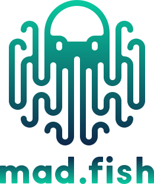
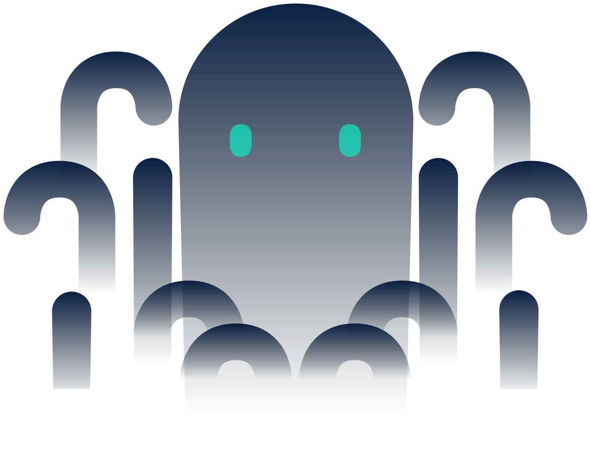

<h1 align="center">
  <a href="https://github.com/madfish-solutions/octus-bridge-core">
    <!-- Please provide path to your logo here -->
    
  </a>
  <br />
  <br />
  Octus Bridge Smart Contracts for Tezos
</h1>

<div align="center">
  <br />
  <a href="#about"><strong>Explore the docs »</strong></a>
  <br />
  <br />
  <a href="https://github.com/madfish-solutions/octus-bridge-core/issues/new?assignees=&labels=bug&template=01_BUG_REPORT.md&title=bug%3A+">Report a Bug</a>
  ·
  <a href="https://github.com/madfish-solutions/octus-bridge-core/issues/new?assignees=&labels=enhancement&template=02_FEATURE_REQUEST.md&title=feat%3A+">Request a Feature</a>
  .
  <a href="https://github.com/madfish-solutions/octus-bridge-core/issues/new?assignees=&labels=question&template=04_SUPPORT_QUESTION.md&title=support%3A+">Ask a Question</a>
</div>

<div align="center">
<br />

[](LICENSE)

[](https://github.com/madfish-solutions)

</div>

---

## About

The scope of this project is a system of the smart contract on the Tezos blockchain enabling arbitrary cross-chain messaging and permissionless asset transferring built on top of it. Interface and infrastructure development are out of this solution.

The new set of contracts will be deployed to Tezos blockchain and is expected to be integrated into the bridge relayers code and Octus frontend.

### Built With

- NodeJS (tested with NodeJS v16+)
- Yarn
- Docker
- Ligo 0.40.0

## Getting Started

### Prerequisites

Install node modules:

```shell
yarn install
```

### Compilation

Compile all smart contracts:

```shell
yarn compile
```

## Testing

```shell
yarn start-sandbox
yarn test
yarn stop-sandbox
```

## Deploy

```shell
yarn migrate
```

## Authors & contributors

The original setup of this repository is by [Madfish.Solutions](https://github.com/madfish-solutions).

For a full list of all authors and contributors, see [the contributors page](https://github.com/madfish-solutions/octus-bridge-core/contributors).

<p align="center"> Made with ❤️ by <a href=https://www.madfish.solutions>Madfish.Solutions</a>
<br />

</p>
